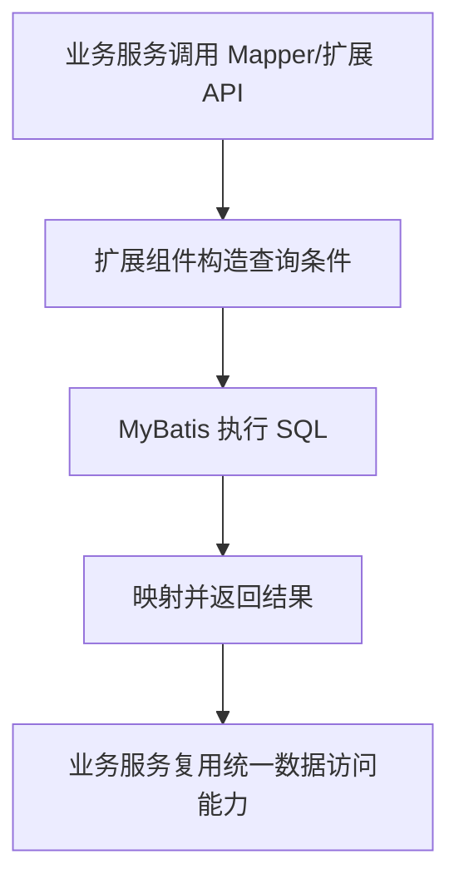



  

# g2rain-mybatis-extensions

下一代AI软件开发范式，AI原生Agent平台，开源的企业级SaaS底座。

g2rain MyBatis 扩展组件，面向数据访问层提供查询、映射、条件构造或持久化增强能力

[官网](https://www.g2rain.com) · [Issues](https://github.com/g2rain/g2rain/issues) · [Discussions](https://github.com/g2rain/g2rain/discussions)

## 目录

- 项目简介
- 平台定位
- 业务域说明
- 功能概览
- 使用场景
- 核心流程
- 流程图
- 技术栈
- 环境要求
- 快速开始
- 构建与镜像
- 代码质量与测试
- 使用示例
- 安全说明
- 与关联仓库的关系
- 模块说明
- 职责边界
- 常见问题
- 参与贡献
- 许可证
- 联系我们
- 致谢

## 项目简介

g2rain MyBatis 扩展组件，面向数据访问层提供查询、映射、条件构造或持久化增强能力

## 平台定位

该仓库位于 g2rain 后端研发支撑层，为多个后端项目提供集成能力、工程化工具或共享扩展。

## 业务域说明

该仓库聚焦于 `MyBatis 数据访问扩展、查询增强与持久化公共能力`。

## 功能概览

| 能力 | 说明 |
| --- | --- |
| 数据访问增强 | 围绕 MyBatis/MyBatis-Plus 扩展查询、映射、条件构造或持久化辅助能力。 |
| 统一持久化约定 | 帮助平台后端服务复用一致的数据访问模式，减少重复封装。 |

## 使用场景

| 场景 | 说明 |
| --- | --- |
| 增强数据访问表达 | 当服务需要更统一或更可扩展的 MyBatis 查询、映射、分页或条件封装时使用。 |
| 复用持久化基础能力 | 当多个后端服务需要共享一致的数据访问辅助能力时，将扩展组件作为基础依赖引入。 |

## 核心流程

| 流程 | 关键步骤 | 代码线索 |
| --- | --- | --- |
| 数据访问扩展流程 | 业务服务引入扩展依赖 → Mapper 或查询组件调用扩展 API → 扩展层构造查询/映射/分页规则 → MyBatis 执行 SQL 并返回统一结果 | pom.xml、MyBatis dependencies、extension classes |

## 流程图

## 技术栈

| 类别 | 说明 |
| --- | --- |
| 运行时 | Java 25 |
| 其他 | Lombok |

## 环境要求

- JDK 25+
- Maven 3.9+

## 快速开始

| 步骤 | 命令或位置 | 说明 |
| --- | --- | --- |
| 准备构建环境 | JDK 25+、Maven 3.9+ | 工具组件通常只需要 Java 与 Maven 构建环境。 |
| 构建组件 | `mvn clean package` | 执行 Maven 构建，生成可发布或可本地安装的组件产物。 |
| 本地安装 | `mvn clean install` | 安装到本地 Maven 仓库，便于业务工程试用依赖。 |

版本号以项目构建配置为准，当前识别为 `1.0.4`。

## 构建与镜像

| 目标 | 命令 | 产物 | 说明 |
| --- | --- | --- | --- |
| 组件产物 | `mvn clean package` | `g2rain-mybatis-extensions-1.0.4.jar` | 执行 Maven 标准构建，生成可发布的公共库组件产物。 |
| 本地 Maven 安装 | `mvn clean install` | `本地 Maven 仓库产物` | 安装到本地 Maven 仓库，便于业务工程本地验证依赖。 |

## 代码质量与测试

| 检查项 | 命令 | 说明 |
| --- | --- | --- |
| Maven Enforcer | `mvn validate` | 约束 JDK 版本、Maven 版本与依赖规则。 |

## 使用示例

| 示例 | 方式 | 内容 | 说明 |
| --- | --- | --- | --- |
| Maven 依赖引入 | Maven | `<dependency><groupId>com.g2rain</groupId><artifactId>g2rain-mybatis-extensions</artifactId><version>1.0.4</version></dependency>` | 在业务工程 pom.xml 中引入该组件。 |

## 安全说明

| 主题 | 说明 |
| --- | --- |
| 依赖可信边界 | 作为平台共享组件或构建工具，应通过组织 Maven 仓库、版本锁定和发布流程控制依赖来源。 |
| SQL 与查询边界 | 数据访问扩展应避免拼接不可信输入，业务服务需要保持参数化查询和权限过滤。 |

## 与关联仓库的关系

本仓库位于 g2rain 后端研发支撑层，通过 Maven 依赖为平台后端服务提供 MyBatis 数据访问扩展能力。

## 模块说明

| 模块 | 职责说明 | 代码线索 |
| --- | --- | --- |
| MyBatis 扩展 API | 提供查询、映射、分页或条件构造等数据访问增强能力。 | mybatis、mapper、extension classes |
| 持久化公共约定 | 沉淀平台后端服务复用的数据访问模式。 | entity/model、mapper support、condition/query classes |

## 职责边界

该仓库主要负责：
- 负责提供 MyBatis 数据访问扩展、查询辅助和持久化公共能力
- 负责沉淀平台后端服务可复用的数据访问约定

该仓库默认不负责：
- 不负责具体业务表结构设计和业务数据治理
- 不绕过业务服务自身的权限校验和数据边界

## 常见问题

| 问题 | 可能原因 | 处理建议 |
| --- | --- | --- |
| 业务工程无法解析依赖 | 组件未发布到当前 Maven 仓库，或 groupId/artifactId/version 配置不一致。 | 检查 Maven 仓库地址、版本号和业务工程 dependencyManagement 配置。 |
| 查询结果或 SQL 不符合预期 | 扩展 API 使用方式、实体映射、Mapper 配置或分页条件不匹配。 | 检查 Mapper、实体字段、MyBatis 配置和生成 SQL。 |

## 参与贡献

我们欢迎所有形式的贡献：Issue 反馈、文档改进、功能建议与代码提交。

推荐流程：

1. Fork 本仓库。
2. 创建特性分支：`git checkout -b feature/your-feature-name`。
3. 提交更改：`git commit -m "Add some feature"`。
4. 推送分支：`git push origin feature/your-feature-name`。
5. 提交 Pull Request。

代码贡献前请尽量补充必要的测试和文档，并确保构建、测试与静态检查通过。

## 许可证

本项目基于 [Apache 2.0许可证](https://github.com/g2rain/g2rain-common/blob/main/LICENSE) 开源。

## 联系我们

- Issues: [GitHub Issues](https://github.com/g2rain/g2rain/issues)
- 讨论: [GitHub Discussions](https://github.com/g2rain/g2rain/discussions)
- 邮箱: g2rain_developer@163.com

## 致谢

感谢所有为 g2rain 项目提交 Issue、代码、文档、建议和使用反馈的开发者们！
